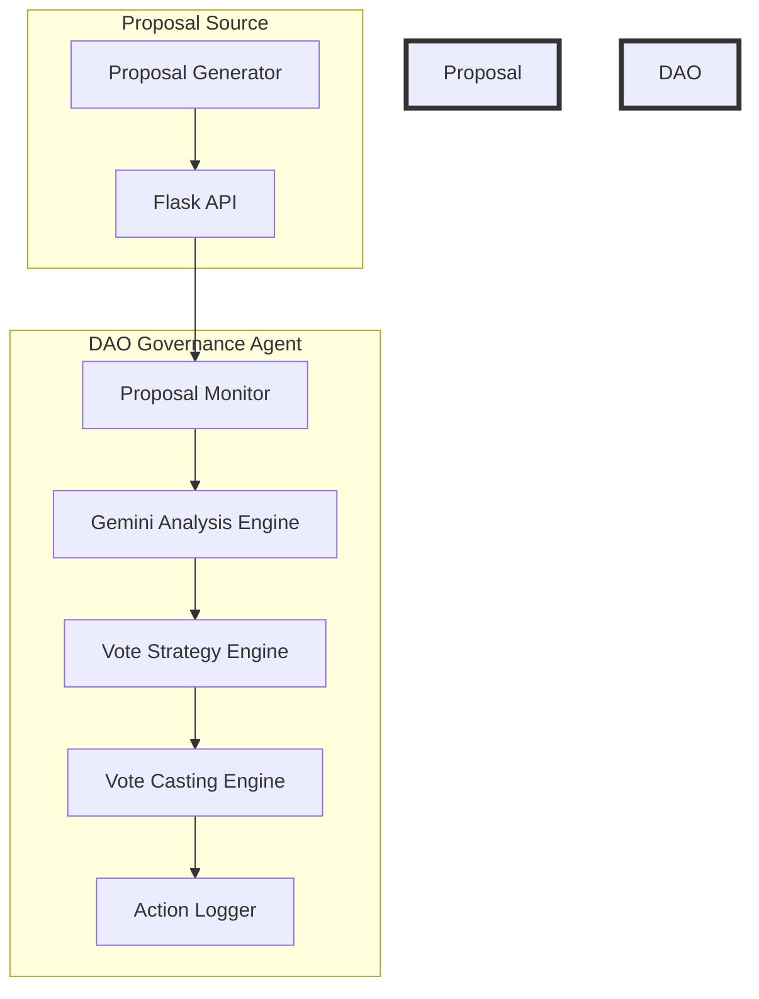
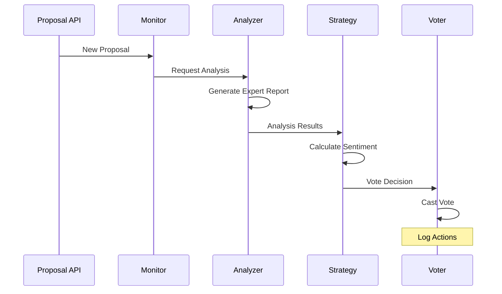
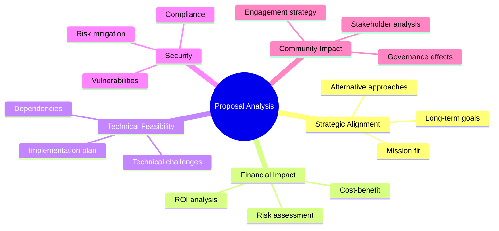

# 🤖 Autonomous DAO Governance Agent

> *Your AI-powered DAO governance assistant that never sleeps! Automatically analyzes proposals, makes informed decisions, and votes on your behalf.*

<div align="center">


</div>

## 🌟 Key Features

- 🔄 **Continuous Monitoring**: Never miss a proposal with 24/7 automated tracking
- 🧠 **AI-Powered Analysis**: In-depth proposal evaluation using Gemini 1.5 Pro
- 🎯 **Smart Voting**: Automated decision-making based on comprehensive analysis
- 📊 **Detailed Reporting**: Rich logging and analysis reports for transparency

## 🏗️ Architecture



## 💡 How It Works



## 🔍 Analysis Categories



## 🚀 Getting Started

1. **Clone the repository**
```bash
git clone https://github.com/yourusername/dao-governance-agent.git
cd dao-governance-agent
```

2. **Install dependencies**
```bash
pip install -r requirements.txt
```

3. **Set up environment variables**
```bash
GOOGLE_API_KEY=your_gemini_api_key
```

4. **Run the application**
```bash
# Terminal 1: Start the API
python simple_api.py

# Terminal 2: Start the Agent
python DAO_governance_agent.py
```

## 📝 Configuration

The agent's behavior can be customized through various parameters:

- Analysis depth and categories
- Voting strategy weights
- Monitoring interval
- Custom proposal sources

## 🛣️ Roadmap

- [ ] Integration with real-world DAO platforms
- [ ] Enhanced voting strategies using historical data
- [ ] Multi-chain proposal monitoring
- [ ] Community feedback integration
- [ ] Customizable analysis templates
- [ ] Web dashboard for monitoring and configuration

## 🔮 Future Development

> **Coming Soon**: Replacing the mock API with real-world DAO integrations! 

We're actively working on:
- Direct integration with major DAO platforms
- Real-time proposal monitoring
- Enhanced analysis capabilities
- Multi-chain support
- Advanced voting strategies

## 🤝 Contributing

Contributions are welcome! Please feel free to submit a Pull Request.

## 📄 License

This project is licensed under the MIT License - see the [LICENSE](license) file for details.

## ⭐ Show Your Support

Give a ⭐️ if this project helped you!
